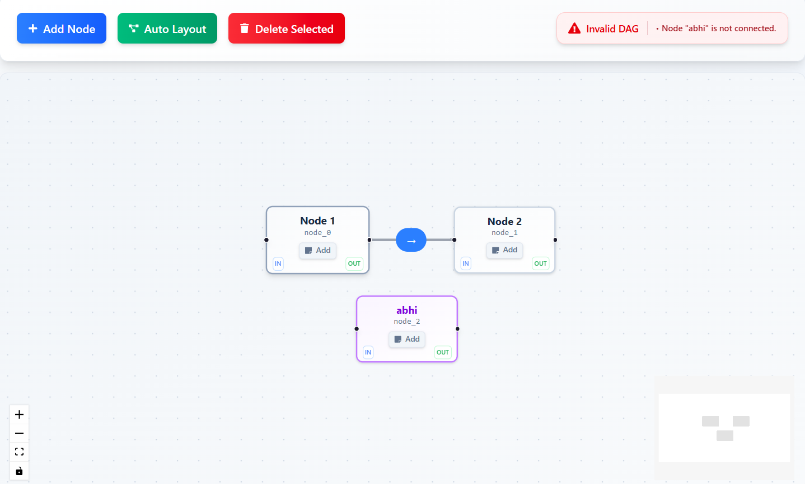

# DAG Builder - Pipeline Editor

A React-based Pipeline Editor that allows users to visually create and manage Directed Acyclic Graphs (DAGs). This tool simulates how real-time data pipelines or processing workflows are constructed using interconnected nodes.

## 🎯 Project Overview

This application provides an intuitive interface for building data processing pipelines through a visual graph editor. Users can create nodes, connect them with directed edges, and validate that their pipeline follows DAG principles.

## ✨ Features

### Core Functionality
- **Add Nodes**: Click "Add Node" button to create new nodes with custom labels
- **Draw Edges**: Manually connect nodes by dragging from outgoing to incoming handles
- **Delete Elements**: Remove selected nodes/edges using the Delete key or delete button
- **Real-time Validation**: Live status showing whether the current structure is a valid DAG
- **Auto Layout**: Automatically arrange nodes in a clean left-right flow using dagre library

### Validation Rules
The pipeline is considered valid only if:
- It has at least 2 nodes
- There are no cycles (no circular dependencies)
- All nodes are connected to at least one edge
- All edges follow correct direction (outgoing → incoming only)
- There are no self-loops (nodes connected to themselves)

### User Experience Features
- **Visual Feedback**: Selected elements are highlighted in purple
- **Direction Indicators**: Clear "in" and "out" labels on nodes
- **Note System**: Add descriptive notes to nodes for better documentation
- **JSON Preview**: Real-time view of the DAG structure for debugging
- **Responsive Design**: Works well on different screen sizes
- **Keyboard Shortcuts**: Delete key for quick removal of selected elements

## 🛠️ Technologies & Libraries

### Core Framework
- **React 19.1.0**: Latest version for building the user interface
- **TypeScript 5.8.3**: For type safety and better development experience
- **Vite 7.0.0**: Fast build tool and development server

### Graph Visualization
- **ReactFlow 11.11.4**: Powerful library for building node-based editors
  - Provides drag-and-drop functionality
  - Handles edge connections and routing
  - Built-in selection and interaction features
  - Custom node and edge components support

### Layout Engine
- **Dagre 0.8.5**: Graph layout library for automatic node positioning
  - Implements hierarchical layout algorithms
  - Supports different directions (left-right, top-bottom)
  - Handles complex graph structures efficiently

### Styling & UI
- **Tailwind CSS 4.1.11**: Utility-first CSS framework
  - Rapid UI development with pre-built classes
  - Responsive design utilities
  - Custom design system with gradients and shadows
- **React Icons 5.5.0**: Comprehensive icon library
  - Used for buttons, indicators, and visual elements
  - Consistent iconography throughout the app

### Development Tools
- **ESLint 9.29.0**: Code linting and quality enforcement
- **TypeScript ESLint**: TypeScript-specific linting rules
- **React Hooks ESLint**: Rules for React hooks best practices

## 🚀 Getting Started

### Prerequisites
- Node.js (version 16 or higher)
- npm or yarn package manager

### Installation

1. **Clone the repository**
   ```bash
   git clone <repository-url>
   cd dag-builder
   ```

2. **Install dependencies**
   ```bash
   npm install
   ```

3. **Start development server**
   ```bash
   npm run dev
   ```

4. **Open your browser**
   Navigate to `http://localhost:5173` to see the application

### Available Scripts

- `npm run dev` - Start development server with hot reload
- `npm run build` - Build for production
- `npm run preview` - Preview production build locally
- `npm run lint` - Run ESLint to check code quality

## 📁 Project Structure

```
src/
├── components/
│   ├── AddNodeModal.tsx      # Modal for adding new nodes
│   ├── AutoLayoutService.ts  # Dagre layout logic
│   ├── Controls.tsx          # Main control buttons
│   ├── CustomEdge.tsx        # Custom edge component
│   ├── CustomNode.tsx        # Custom node component
│   ├── JsonPreview.tsx       # JSON structure preview
│   ├── NoteModal.tsx         # Modal for node notes
│   └── ValidationService.ts  # DAG validation logic
├── App.tsx                   # Main application component
├── main.tsx                  # Application entry point
└── index.css                 # Global styles
```

## 🎨 Key Design Decisions

### Component Architecture
- **Modular Design**: Each feature is separated into its own component
- **Service Layer**: Business logic (validation, layout) separated from UI components
- **Custom Components**: Extended ReactFlow's base components for better UX

### State Management
- **Local State**: Used React's useState for simple state management
- **Event-Driven**: Components communicate through props and callbacks
- **Real-time Updates**: Validation runs on every graph change

### User Experience
- **Visual Hierarchy**: Clear distinction between valid/invalid states
- **Immediate Feedback**: Real-time validation and visual indicators
- **Accessibility**: Keyboard shortcuts and proper ARIA labels
- **Responsive**: Works on desktop and tablet devices

## 🔧 Implementation Challenges

### 1. Edge Direction Validation
**Challenge**: Ensuring edges only connect outgoing to incoming handles
**Solution**: Used ReactFlow's built-in handle system with custom validation logic in ValidationService

### 2. Cycle Detection
**Challenge**: Implementing efficient cycle detection in a directed graph
**Solution**: Used Depth-First Search (DFS) with recursion stack to detect cycles in O(V+E) time

### 3. Auto Layout Integration
**Challenge**: Integrating dagre with ReactFlow's coordinate system
**Solution**: Created AutoLayoutService that converts between coordinate systems and applies dagre's layout

### 4. TypeScript Type Safety
**Challenge**: Ensuring type safety with ReactFlow's complex types
**Solution**: Created custom interfaces extending ReactFlow's base types and used proper type guards

### 5. Real-time Validation
**Challenge**: Maintaining performance with frequent validation checks
**Solution**: Optimized validation logic and used React's useCallback for performance

## 🎯 Future Enhancements

- **Undo/Redo**: Add history management for better user experience
- **Node Types**: Support different node types with color coding
- **Export/Import**: Save and load pipeline configurations
- **Collaboration**: Real-time collaboration features
- **Advanced Layout**: More layout algorithms and customization options
- **Performance**: Virtualization for large graphs

## 📱 Demo & Screenshots

### Live Demo
🌐 **Live Application**: [https://dag-editor.vercel.app/](https://dag-editor.vercel.app/)

### Screenshots


*Main interface showing the DAG Builder with nodes, edges, and validation status*

## 🤝 Contributing

1. Fork the repository
2. Create a feature branch (`git checkout -b feature/amazing-feature`)
3. Commit your changes (`git commit -m 'Add amazing feature'`)
4. Push to the branch (`git push origin feature/amazing-feature`)
5. Open a Pull Request

## 📄 License

This project is licensed under the MIT License - see the LICENSE file for details.

## 🙏 Acknowledgments

- ReactFlow team for the excellent graph library
- Dagre contributors for the layout algorithms
- React and TypeScript communities for the amazing tools
- Tailwind CSS for the utility-first styling approach
